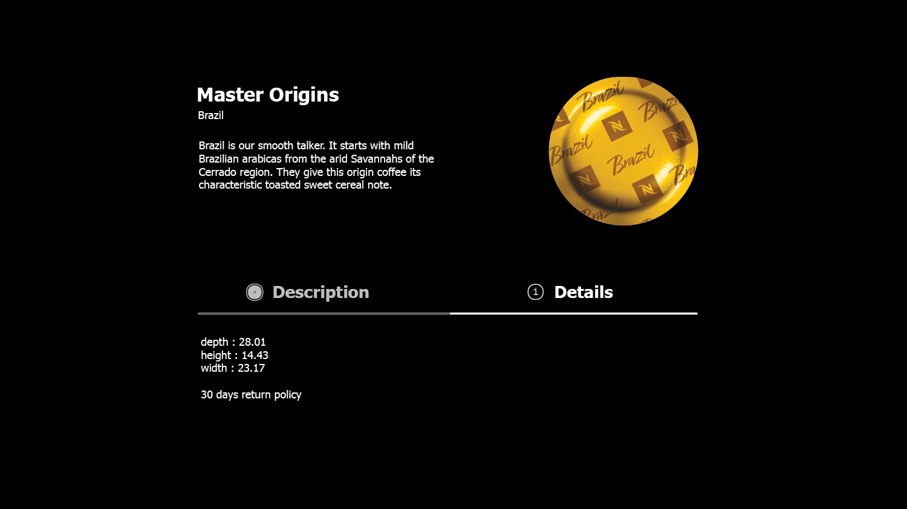

# 📦 Nespresso UI Exercise

## The exercise

Inside `src/template.html` you will find some simple markup, you have to add the neccessary HTML markup and style it according to what you can see in `example-desktop-tab-1.png`, `example-desktop-tab-2.png` and `example-mobile-tab-1.png` , `example-mobile-tab-2.png` files inside the root folder of the repository

### Expected Mobile view
Description Tab Selected | Details Tab Selected  
:-------------------------:|:-------------------------:
  |  

### Expected Desktop view
Description Tab Selected | Details Tab Selected  
:-------------------------:|:-------------------------:
  |  

## We want to add the following characteristics to the template:

### Both mobile and desktop
- When you click any of the tabs, you have to fetch data from `https://dummyjson.com/products/{id}` (where `id` should be random number "from 1 to 50") and display the "description" in the first selected tab (description tab). When the second tab (details) is clicked you should show the "dimensions" and the "returnPolicy" fields inside the tab content.
- You should limit the clicking of the tabs to only fetch data at most once per second (so if you click a lot of times on any of the tabs in quick succession, it should only fetch data once per second).
- When the page loads, or you click on a tab, its content should be visible (if no tab has been clicked then the default "description" should be loaded on the tab content area).
- The tab button should stay highlighted when clicked/active or hovered/focused (as you can see in the `example-desktop-tab-1.png` and `example-desktop-tab-2.png`).
- UI should have zero WCAG 2.1 errors (when audited with any of common tool such AXE or WAVE chrome extensions)
- It should be accessible when using Keyboard navigation (at least using tab key + direction arrows on the proposed interface tabs)
- When using keyboard navigation after selecting any tab the focus should change to the respective tab-content.
- If possible (bonus) animation should be added to the "active" and "hover" states of the tabs and a fade in effect every time the tab content is updated.

### Mobile / Tablet
- Follow the desktop requirements but the click behaviour should be replaced by tap.

### Feel free to do it however you want, just try to follow these rules:

- You are able to modify the HTML, CSS and JS files.
- The result of the Rendered Markup should be Accessible.
- CSS syntax should follow a "Mobile First" approach

## Installation

```bash
npm i
```

### Development server

```bash
npm start
```

You can view the development server at http://localhost:8080.

### Production build

```bash
npm run build
```
